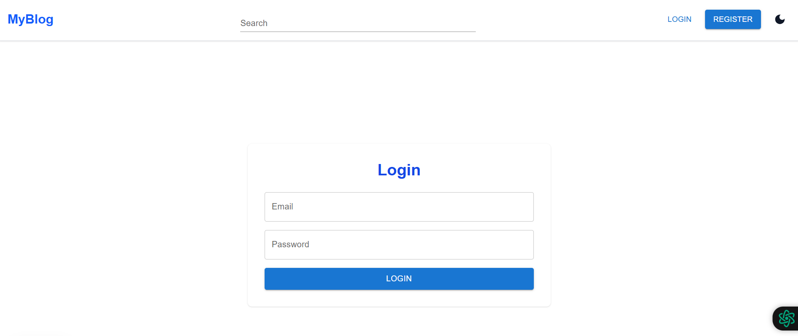
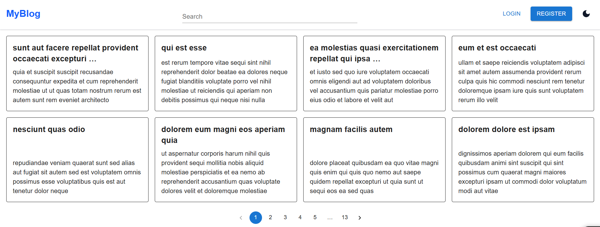
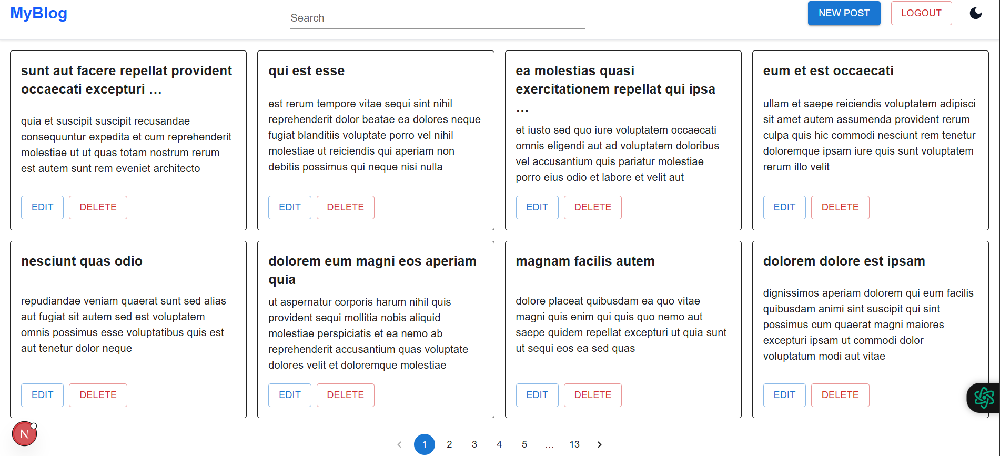
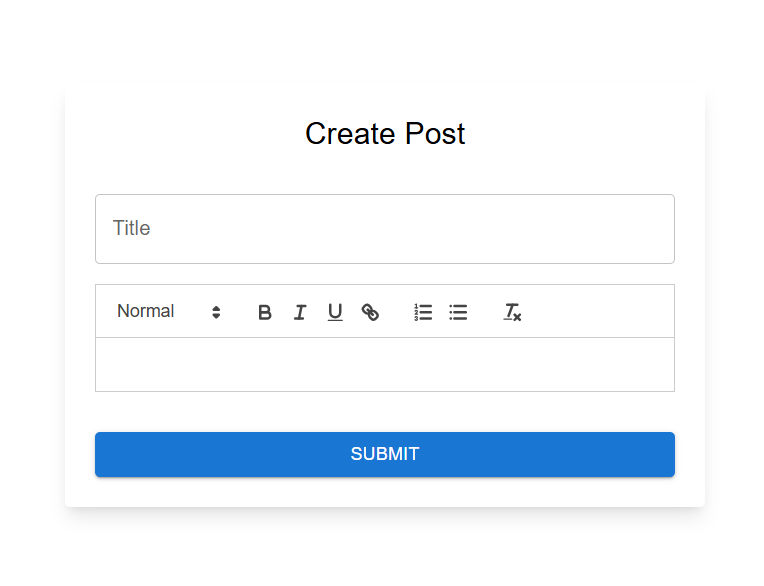
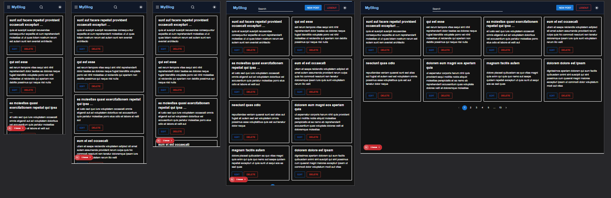

## Getting Started

```
pnpm i
pnpm dev
```

## For demo test
```
email: testuser@gmail.com
password: Password@123
```

## Features
1. Authentication 
2. Blog Post Management
3. Protected Routes
4. rich-text editor for blog content. 
5. pagination. 
6. search feature. 
7. dark/light theme. 


## Used packages, tools and resources 
* Nextjs
* Redux Toolkit
* Next.js Router 
* TailwindCSS, MUI
* localStorage 
* Yup (form validation)
* React-hook-form
* React-quill (RichTextEditor)
* axios
* JWT token
* Dummy API: https://jsonplaceholder.typicode.com


## Screenshot
### Register page


### Login page


### Before login


### After login


### new post with RichTextEditor


### Responsive design with dark-mode



